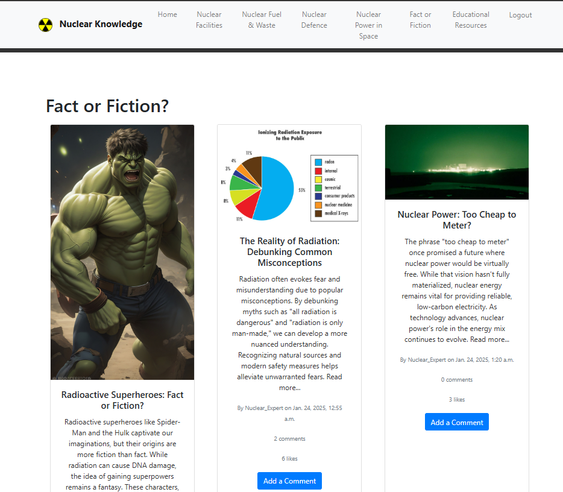

> 
> 

# Nuclear Physics Blog App - Nuclear Knowledge 

TO DO (link to live page)######

TO DO ###### link to Heroku 
> [View live project here](https://nature-blog-5d97cb035a15.herokuapp.com/)

TO DO ######
For Admin access with relevant sign-in information: [Nature blog Admin](https://nature-blog-5d97cb035a15.herokuapp.com/admin/)
> 
> This is an information resource to share and create blog posts about the many aspects of Nuclear physics. Users can read and comment and reply on each post so that they can share their thoughts and ideas and feel part of the wider scientific community.
---
> 

>
---

## CONTENTS   TO DO #####

 - [User experience (UX)](#user-experience)
     - database planning
     - purpose and intended audience		 
     - user stories
 - [Creation process](#creation-process)
		 
     - [Wireframes](#wireframes)
 - [Design](#design)
		 
     - Colour scheme
		 
     - Typography
		 
     - Imagery
 - [Website features](#website-features)
 - [Tablet/mobile view](#tablet/mobile-view)
 - [Future features](#future-features)
 - [Technologies used](#technologies-used)
 - [Ai Augmentation](#ai-augmentation) 
 - [Deployment](#deployment)
 - [Testing](#testing)
 - [Credits](#credits)
 ---
 ## USER EXPERIENCE
 ---
**Database Planning**  TO DO ######

I used [LucidChart](https://lucid.app/documents#/home?folder_id=recent) to create my ERD for my database. It is a simple model with only four models: User, Post, Comment and Category.
The User model was imported from Django Allauth

**Purpose and Intended Audience**

This website serves as an educational resource dedicated to the fascinating field of Nuclear Physics. Designed to cater to diverse interests, the site offers a wealth of information spanning various aspects of this scientific discipline. Our goal is to make Nuclear Physics accessible and engaging for individuals of all ages.

The site invites users to immerse themselves in the scientific community by exploring a wide array of topics and categories within Nuclear Physics. By encouraging users to like, comment on, and reply to individual topic posts, we foster a conversational and interactive environment. This approach allows users to fully engage in scientific discussions, whether as contributors with advanced academic knowledge or as newcomers experiencing their first taste of participating in a scientific community. It is desined to be responsive so that users can access the content on any type of device.

**User stories**
		 
Title | User story | MoSCoW prioritisation |
--- | --- | --- |
**Account Registration** | As a **site user** I can **register an account** so that I can **view the topic pages** | Must have |
**View list of blog posts** | As a **site user** I can **view a list of blog posts from a topic page** so that **I can select which post to view** | Must have |
**Open Post** | As a **site user** I can **click on a post** so that **I can read the full text** | Must have |
**View Comments** | As a **site user** I can **view comments on an individual post** so that **I can read the conversation** | Must have |
**Comment on a Post** | As a **site user** I can **create comments on a post** so that **I can be involved in a conversation** | Must have |
 **Modify or delete comments on a post** | As a **site user** I can **edit/modify or delete my comments on posts** so that **I can take part in a conversation, and manage the conversation content** | Must have |
**Manage Posts** | As a **site admin** I can **create, read and update posts** so that **I can manage my blog content** | Must have |
 **Access topic pages from a main landing page**| As a **site user** I can **view the topics available** so that **I can select topics that contain blogs of interest within a topic category** | Should have |
 **Create Drafts**| As a **site admin** I can **create draft blog posts** so that **I can finish the content later** | Should have |
 **Share Resources** | As a **teacher** I can **upload and download educational resources** so that **I can share materials with studetns and colleagues** | Could have |
 **Create blog posts** | As a **site user** I can **create new blog posts** so that **my audience has up to date and new content to enjoy** | Could have |
 **Modify or delete User blog posts** | As a **User blog author** I can **edit or delete the blog posts I have created** so that **I can keep blog posts relevant, and I am able to correct mistakes** | Could have |
 **Notifications**| As a **site user** I can **recieve notifications** when **other users comment on the same post/on posts the user has created** | Could have |
 
 
I used [GitHub Projects](https://github.com/users/JOCPhys/projects/13) to create a project board and populated it with user stories and added labels according to MoSCoW prioritisation.
All of the 'must have' user stories were completed with any other issues being carried over to the next sprint of the project development.

[Project Board](readme.docs/project_board_Moscow_labels.png)

Each user story had acceptance criteria added. 

TO DO ######
The key user stories and acceptance criteria are listed below with evidence of how I completed each issue:

Acceptance criteria:
Site admin can log in
Once logged in can create a post
The fulfillment of these criteria can be demonstrated by the presence of blog posts on the site

Acceptance criteria:
As a logged in user their comments are available to edit/delete - this was set up to display CRUD functionality and tested extensively during development. 
	 

Acceptance criteria:
The user can log in and create comments
If there is more than one comment then there is a conversation thread
This user story also contributed towards the CRUD functionality and was tested throughout every phase of the project development
 
 
		 
---

## CREATION PROCESS

  ### Wireframes
  I created basic wireframes using Balsamiq. All login and registration forms were created by allauth and as such I haven't provided wire frames.

Landing page wireframe with the list of Catergories/Topics to view for desktop, tablet and mobile devices

Category/Topic Pages (example of 1 of 6 category pages) wireframe for desktop, tablet and mobile devices

Topic detail wireframe for an indivdual Topic-Blog detail page with comments feature for desktop, tablet and mobile devices

---

## DESIGN
  - **Typography**
    
    [Google Fonts](https://fonts.google.com/) was used to choose the font used. I had the idea that I wanted two fonts to 
   differentiate the general site text from the personal blog text so the following font was imported:
    
    The Gloria Hallelujah font was chosen for the blog introduction and the blog entries themselves as it resembles 
    handwritten text and I felt it would lend a more personal touch to the blog. I wanted it to feel as though the user was 
    reading my diary entries directly.
    
  - **Colour scheme**
    
  

        
    As the blog is about nature and wildlife I wanted the colour scheme to reflect the colours I have in my garden. I wanted 
    strong, primary colours for impact as they would be against a white background, but didn't want a large palette as I 
    included lots of images of wildlife that I didn't want to detract from. 
    The palette was chosen using [Coolers](https://coolors.co/)
    
  - **Imagery**
    
    The majority of the images used in each blog post are my own images taken of my garden and I was really proud to be able 
    to use them. I had a lot of fun creating posts and uploading images. Seeing the finished article on the screen gave 
    me enormous pleasure despite the fact that the load time for my site was compromised.
    Two of the images were royalty-free stock images from [Pexels](https://www.pexels.com/) Acknowledgements for the 
    individual photographers are in the [credits](#credits) section.
 

 ---

## WEBSITE FEATURES TO COMPLETE######

  **MAIN VIEW**
  

  
landing page

  Users arrive directly on the landing page which outlines the 6 categories of topics available immediately rather than requiring them to log in or register before being able to see anything. 
  I felt it would draw people in more and encourage them to then sign-up in order to see more.
  

 

**TOPIC CATEGORIES VIEW** TO COMPLETE IMAGE LINKS ######

  
Example of a Topic Category page

  Users choose one of 6 categories of topics available on the landing page. They will be required to sign-in/register to access these pages. Each of these pages has a minimum of 6 indivdual topic-blogs displayed as cards that each display the title of the topic, a relevant topic image, the author of the blog, an excerpt and an invite to comment. The number of likes and number of comments is displayed to entice other users to join.A click anywhere on the card will take the user to the topic blog detail.
  

 
    
  **TOPIC-BLOG POST DETAIL VIEW**
  

  
The detailed view of each blog 

					     
  

  
  

  Each topic blog post is shown with the image and the full detail of the post, displaying the number of 'likes' and the number of 'comments'. Users can reply to comments. Comments and replies can be edited. 

   

  **COMMENT FEATURE**
  

  
Comment box

  

	  
  

  Each blog post gives the user the option to add comments. They can also edit/delete commemts they have previously made. The 
 comments then appear colour coded so that the user can tell which have been approved by admin.

  **SOCIAL LINKS FEATURE**

 

  The footer gives links to social sites and GitHub. The colour was chosen to match the header and fit in with the overall colour scheme.

 ---

## FUTURE FEATURES
The following would be options to consider including in future versions of the website:

Next Sprint: 
  - Users have an option to contribute to any of the topics by creating a blog without the need for access to the admin panel, can save it as draft and continue to edit - although final approval for publishing would be at the discretion of the admin or trusted staff Users can view their own completed or partially completed published and unpublished blogs on their own 'My Topics' page. NOTE- this is partially developed at this stage but full functionality not yet complete. 

Additional Sprints:
  - The 'Educational Resources' page to be developed as a sharing page for educators to upload and download educational resources for the teaching and learning of Nuclear physics. 

  - An about page for information about each of the topic-blog creators - invite to a user who has created 10 successfully published blogs. 
    
  - Topic-blog authors can receive notifications (via a preferred method eg email or in-app) when other users comment on a blog-topic they have publsihed
    

## TECHNOLOGIES USED

  ### Languages Used

### Frameworks, Libraries, and Programs Used

 ---

## DEPLOYMENT
The site was deployed to Heroku. The steps to deploy are as follows:
 - Install the gunicorn python package and create a file called 'Procfile' in the repo's root directory
 - In the Procfile write 'web: gunicorn lunar_lists.wsgi'
 - In settings.py add ".herokuapp.com" to the ALLOWED_HOSTS list
 - In settings.py add 'https://*.herokuapp.com' to CSRF_TRUSTED_ORIGINS list, git add, commit and push to github

Navigate to the Heroku dashboard
 - Create a new Heroku app
 - Give it a name and select the region 'Europe'
Navigate to settings tab and scroll down to Config Vars
 - Click 'Reveal Config Vars'
 - Add the following keys:
         key = DATABASE_URL | value = (my secret database url)
         key = SECRET_KEY | value = (my secret key)
Navigate to Deploy tab
 - Connect to GitHub and select the repo 'lunar-lists'
 - Scroll down to 'Manual deploy' and select the 'main' branch
 - Click 'Deploy Branch'
   

 ---

## TESTING

 ### Unit Tests

The following Unit Tests were performed:

| Test Category            | Test Description                                                                 |
|--------------------------|----------------------------------------------------------------------------------|
| **Test Setup**           | Initializes test data, including creating a regular user, an admin user, and a sample topic. |
| **Test Topic Detail Page** | Verifies that the topic detail page renders correctly with the topic details when accessed by an admin user. |
|                          | Ensures that the create topic page renders correctly and uses the appropriate template. |
|                          | Confirms that the edit topic page renders correctly and uses the appropriate template. |
|                          | Checks that the delete topic page renders correctly and uses the appropriate template. |
| **Test Forms**           | Ensures that the comment form is valid when provided with valid data.             |
|                          | Verifies that the comment form is invalid when provided with empty data.          |
|                          | Confirms that the topic form is valid when provided with valid data.              |
|                          | Ensures that the topic form is invalid when provided with empty data.             |
| **Test Models**          | Verifies that the string representation of the topic model returns the topic title. |
|                          | Ensures that the string representation of the comment model returns the first 20 characters of the comment body. |
| **Test Comment Functionality** | Verifies that a comment can be added to a topic.                              |
|                          | Ensures that a comment can be edited.                                             |
|                          | Confirms that a comment can be deleted.                                           |

  ### HTML validation

I have used the W3C Markup validator to validate all of my HTML code - [W3C Markup Validator](https://validator.w3.org/)

Pages in this project are developed using DTL and all except the landing page (and login, logout and sign-up pages which are Django admin tools that I have no control over) require user authentication. The HTML validator will throw errors if I were to use the URL so I followed the below approach for the landing page and the templates:
  - navigate to the deployed Heroku link
  - right click to find the 'view page source' link
  - copy and paste the HTML code from here into the validator via the direct input

[home page html validation](readme.docs/landing_page_validation.png)
[A topic page html validation](readme.docs/a_topic_page_validation.png)

HTML was checked and had no errors or warnings to show as indicated above. 
The home (landing) page had some initial syntax errors which were identified and corrected and then commited the code and the validation was clear.

   ### CSS validation

[CSS validation](readme.docs/css_validation.png)

[W3C CSS Validator](https://jigsaw.w3.org/css-validator/) was used to validate the CSS file. External CSS for Bootstrap, provided by [CDN](https://cdnjs.cloudflare.com/ajax/libs/bootstrap/5.2.3/css/bootstrap.min.css) was not tested.

   ### Javascript validation  TO DO ######

  [JavaScript Validator](https://jshint.com) - the JavaScript validation did not throw up and issues. The fact that the use of let and const to define variables and template literals is only available with ES6 was highlighted.

   ### Python validation TO DO ######
[CI Python Linter](https://pep8ci.herokuapp.com/#) was used to validate the python files I created or edited myself.
Initial errors were thrown up involving line length of comments and spacing but these were corrected.    

  

## Lighthouse scores via Chrome dev tools 

The performance score is low due to the amount of images used but all the images have been compressed.

  

### Accessibility     

The site was tested via WAVE the web accessibility evaluation tool and showed some alerts for contrast between the text and the background colour.
The first was for the message warning a user they are not logged in, which had white text against a bright red. The colour of the background was muted and checked via [Contrast Finder](https://app.contrast-finder.org/?lang=en) which showed excellent contrast. 
There was also a contrast issue between the white text and the orange background in the navbar and footer but I felt this was not enough of an issue to change the appearance and style of the whole site.

 

### Issues/Bugs
  
  - On the blog post detail page the image is only showing the top part
  - The images on the main page are very large and not a uniform shape....I decided I like being able to see the full image rather than limiting how much to see and I like
    the fact that everything isn't uniform but that might just be me!
 - there are too many to list in all honesty, so apologies, but I didn't have the ability or confidence to be able to sort everything out in this version of the project...hopefully I 
   will have more luck with a resubmission...I will be less stressed  and have time to learn Django more

### Agile Process
I made an attemtpt to follow an agile process. I had a project board in github which I updated with my user stories. Each user story was labelled according to MoSCoW prioritisation and had acceptance criteria. If I'm honest I didn't then keep the board up to date as I should have as I was so focused on the minutiae of the project and the stress of not thinking I would be able to actually produce anything that the board was the last priority. I have updated it since drawing a line under my development for now and many of the user stories have been moved into the finished section. There are several still in the backlog which have been added to my future features.
I have learned a lot for the future about planning and a large part of that is using the project board more and following an agile process more closely to keep myself on track.

## CREDITS

**Content**
  - [Kera Cudmore/readme-examples on GitHub](https://github.com/kera-cudmore/readme-examples)
   was used to help write the README.md
  - [Code Institute Sample README](https://github.com/Code-Institute-Solutions/SampleREADME)
  was used as a reference when writing the README.
  - [Django project - build a simple blog](https://www.youtube.com/watch?v=S9-Bt1JgRjQ&list=PLOLrQ9Pn6cawWd-5UZM6CIm0uqFXeBcTd&index=5) was used to give a tutorial for setting up a blog app in Django and adding a category model
  - [Code Institute](https://learn.codeinstitute.net/) was used for extra reference for HTML, CSS, Python and Django
  - [W3 Schools](https://www.w3schools.com/) was used for reference on syntax
  - [Stack Overflow](https://stackoverflow.com/) was used for syntax and coding queries
  
**Media**
  - All images not my own were taken from [Pexels](https://www.pexels.com/). Credit to the individual artists: Graeme Travers for Damselfly and Mark A Jenkins for Blue Tit 
  - [Amiresponsive](https://ui.dev/amiresponsive) for the responsivity mockup on the README.

  - [Ignore X frame headers](https://chromewebstore.google.com/detail/ignore-x-frame-headers/gleekbfjekiniecknbkamfmkohkpodhe)
    was used to download a Chrome extension to allow the resposivity image to be taken

**Acknowledgements**
  - Amy Richardson (Facilitator with Code Institute) - For providing support and resources and tirelessly encouraging
  - Mark Briscoe (SME with Code Institute) - For providing technical knowledge and support with coding and GitHub/GitPod and being constantly 
    encouraging and positive
  - John Rearden (Coding coach with Code Institute) - for amazing coding expertise and calm advice
  - Ruairidh MacArthur (Coding coach with Code Institute) - for amazing coding expertise and calm advice
  - my amazing cohort for the support and laughs and encouragement - particularly Alex Curnow for making me stay every time I was determined to quit