> 
> 

# Nuclear Physics Blog App - Nuclear Knowledge 

TO DO (link to live page)######

TO DO ###### link to Heroku 
> [View live project here](https://nature-blog-5d97cb035a15.herokuapp.com/)

TO DO ######
For Admin access with relevant sign-in information: [Nuclear Knowledge blog Admin](https://)
> 
> This is an information resource to share and create blog posts about the many aspects of Nuclear physics. Users can read and comment and reply on each post so that they can share their thoughts and ideas and feel part of the wider scientific community.
---
> 

>
---

## CONTENTS

 - [User experience (UX)](#user-experience)
     - database planning
     - purpose and intended audience		 
     - user stories
 - [Creation process](#creation-process)
     - [Wireframes](#wireframes)
 - [Design](#design)
     - Colour scheme
     - Typography
     - Imagery
 - [Website features](#website-features)
 - [Tablet/mobile view](#tablet/mobile-view)
 - [Future features](#future-features)
 - [Technologies used](#technologies-used)
 - [Ai Augmentation](#ai-augmentation) 
 - [Deployment](#deployment)
 - [Testing](#testing)
 - [Credits](#credits)
 ---
 ## USER EXPERIENCE
 ---
**Database Planning**  TO DO ######

I used [LucidChart](https://lucid.app/documents#/home?folder_id=recent) to create my ERD for my database. It is a simple model with only four models: User, Post, Comment and Category.
The User model was imported from Django Allauth

**Purpose and Intended Audience**

This website serves as an educational resource dedicated to the fascinating field of Nuclear Physics. Designed to cater to diverse interests, the site offers a wealth of information spanning various aspects of this scientific discipline. Our goal is to make Nuclear Physics accessible and engaging for individuals of all ages.

The site invites users to immerse themselves in the scientific community by exploring a wide array of topics and categories within Nuclear Physics. By encouraging users to like, comment on, and reply to individual topic posts, we foster a conversational and interactive environment. This approach allows users to fully engage in scientific discussions, whether as contributors with advanced academic knowledge or as newcomers experiencing their first taste of participating in a scientific community. It is desined to be responsive so that users can access the content on any type of device.

**User stories**
		 
Title | User story | MoSCoW prioritisation |
--- | --- | --- |
**Account Registration** | As a **site user** I can **register an account** so that I can **view the topic pages** | Must have |
**View list of blog posts** | As a **site user** I can **view a list of blog posts from a topic page** so that **I can select which post to view** | Must have |
**Open Post** | As a **site user** I can **click on a post** so that **I can read the full text** | Must have |
**View Comments** | As a **site user** I can **view comments on an individual post** so that **I can read the conversation** | Must have |
**Comment on a Post** | As a **site user** I can **create comments on a post** so that **I can be involved in a conversation** | Must have |
 **Modify or delete comments on a post** | As a **site user** I can **edit/modify or delete my comments on posts** so that **I can take part in a conversation, and manage the conversation content** | Must have |
**Manage Posts** | As a **site admin** I can **create, read and update posts** so that **I can manage my blog content** | Must have |
 **Access topic pages from a main landing page**| As a **site user** I can **view the topics available** so that **I can select topics that contain blogs of interest within a topic category** | Should have |
 **Create Drafts**| As a **site admin** I can **create draft blog posts** so that **I can finish the content later** | Should have |
 **Share Resources** | As a **teacher** I can **upload and download educational resources** so that **I can share materials with studetns and colleagues** | Could have |
 **Create blog posts** | As a **site user** I can **create new blog posts** so that **my audience has up to date and new content to enjoy** | Could have |
 **Modify or delete User blog posts** | As a **User blog author** I can **edit or delete the blog posts I have created** so that **I can keep blog posts relevant, and I am able to correct mistakes** | Could have |
 **Notifications**| As a **site user** I can **recieve notifications** when **other users comment on the same post/on posts the user has created** | Could have |
 
 
I used [GitHub Projects](https://github.com/users/JOCPhys/projects/13) to create a project board and populated it with user stories and added labels according to MoSCoW prioritisation.
All of the 'must have' user stories were completed with any other issues being carried over to the next sprint of the project development.

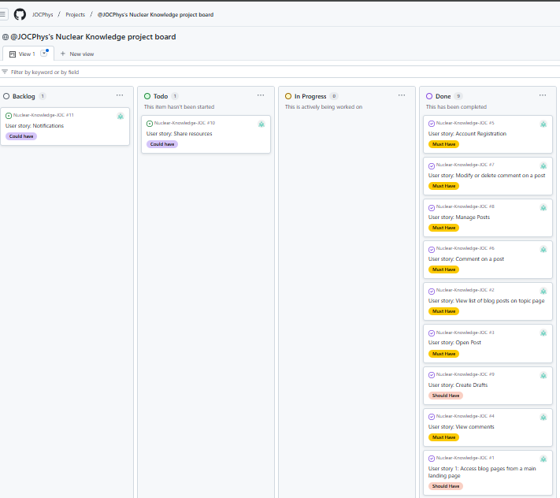

Each user story had acceptance criteria added.The fulfillment of the criteria for each of these can be demonstrated by the presence of the features on the site (see below). The CRUD funtionality of the comments model was tested extensively throughout each development phase both manually and through automated unit tests. 

---

**SITE USER GOALS**

Easy Navigation:
- Users should be able to navigate the site effortlessly and find the information they need quickly.

Access to Information:
- Provide users with comprehensive and accurate information on nuclear topics.

Engaging Content:
- Offer engaging and interesting content that keeps users coming back for more.

Community Interaction:
- Allow users to interact with each other through comments, likes, and replies to foster a sense of community.

User Registration and Authentication:
- Enable users to easily register, log in, and manage their profiles.

Responsive Design:
- Ensure the site is accessible and functional on all devices, including desktops, tablets, and smartphones.

Educational Resources:
- Provide valuable educational resources for students, educators, and enthusiasts.

Regular Updates:
- Keep the content fresh and up-to-date with regular posts and news updates.

Secure Environment:
- Ensure the site is secure and user data is protected.

**SITE-OWNER GOALS**

User-Friendly Interface:
 -Create an intuitive and enjoyable browsing experience with easy navigation and quick access to information.

High-Quality Content:
- Maintain the blog as a reliable source by providing accurate and well-researched information on nuclear physics.

Responsive Design:
- Ensure the website is accessible on all devices, including desktops, tablets, and smartphones.

Community Engagement:
- Encourage user interactions through comments, likes, and replies to foster a sense of community.

Site Security:
- Protect the website and users from security threats with robust security measures and data privacy.

User Authentication:
- Provide a secure and user-friendly process for registration, login, and profile management.

Educational Resources:
- Offer valuable educational materials for students, educators, and enthusiasts to enhance their understanding of nuclear topics.

## CREATION PROCESS

  ### Wireframes
  I created basic wireframes using Balsamiq. All login and registration forms were created by allauth and as such I haven't provided wire frames.

Landing page wireframe with the list of Catergories/Topics to view for desktop, tablet and mobile devices

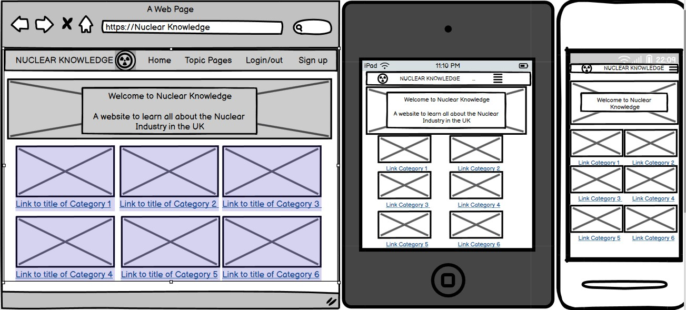

Category/Topic Pages (example of 1 of 6 category pages) wireframe for desktop, tablet and mobile devices

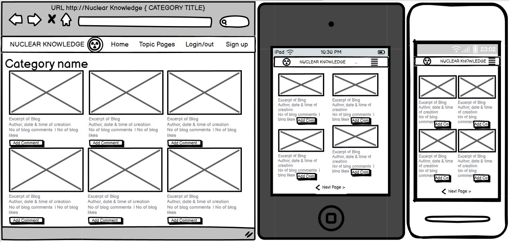

Topic detail wireframe for an indivdual Topic-Blog detail page with comments feature for desktop, tablet and mobile devices

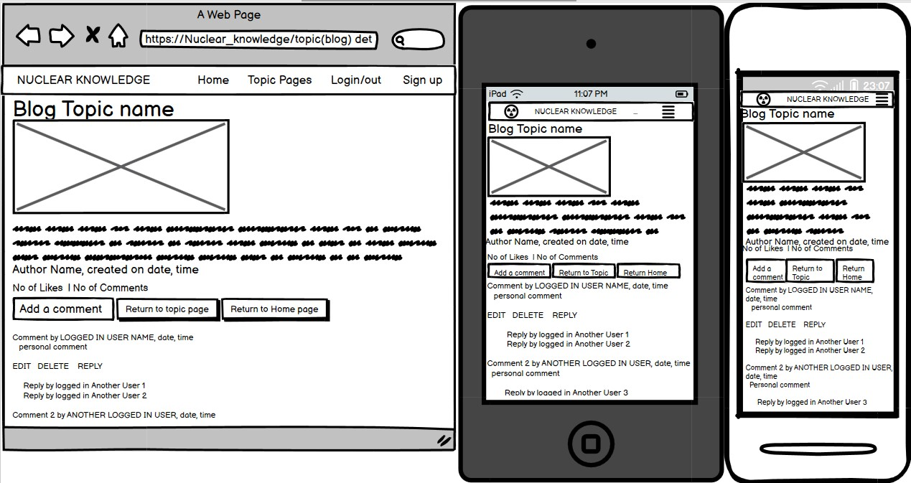

---

## DESIGN

### Typography

The website uses the following fonts:

- **Arial**: The primary font used throughout the website for its clean and professional appearance. Arial is a widely available sans-serif font that ensures readability and consistency across different devices and browsers.

### Colour Scheme

The color scheme of the website is designed to provide a clean, non-intrusive background that is easily viewed in both light and dark modes. This design choice follows a style often used by information and education sites, such as Wikipedia. The primary colors used are:

- **Black and White**: The almost black and white color scheme provides a neutral background that does not distract from the content. This ensures that the text is easily readable and the images stand out.
- **Accent Colors**: 
  - **Blue (#005eff)**: Used for links, buttons, and other interactive elements to draw attention without being overwhelming.
  - **Green (#28a745)**: Used for positive actions such as the "Add Comment" button.
  - **Yellow (#ffc107)**: Used for the "Return Home" button to provide a bright, noticeable call to action.
  - **Red (#e0a800)**: Used for hover states to indicate interactivity.

The palette was chosen using [Coolors](https://coolors.co/).

### Imagery

The majority of the images used in each blog post are generated by DALL·E or sourced from Pixabay. These images are chosen to enhance the visual appeal of the blog posts and provide relevant context to the content. The use of high-quality images ensures that the website is visually engaging and informative.

- **DALL·E**: AI-generated images via Chat GPT that provide unique and creative visuals for the blog posts. 
- **Pixabay**: Royalty-free stock images that are used to complement the content. [Pixabay](https://pixabay.com/images/search/nuclear/)

The 'Radioactive Hazard Symbol' is used as the icon to enhance the visual appeal and usability of the website. The same icon is included both on each page in the Navbar and as a recognisable icon associated with Nuclear physics as favicon for the tab. 

### Layout and Styling

The website features a consistent layout and styling across all pages, ensuring a cohesive user experience. Key design elements include:

- **Header**: The header contains a collapsible navbar that is consistent across all pages. It includes links to the main sections of the website, such as Home, Nuclear Facilities, Nuclear Fuel & Waste, Nuclear Defence, Nuclear Power in Space, Fact or Fiction, and Educational Resources. The navbar also includes login and signup links for unauthenticated users and a logout button for authenticated users.
- **Collapsible Navbar**: The navbar is designed to be responsive and collapses into a hamburger menu on smaller screens. This ensures that the navigation is accessible and user-friendly on all devices.
- **Footer**: The footer is consistent across all pages and includes a copyright notice. It maintains the same styling as the header, providing a cohesive look and feel across all pages.
- **Main Content Area**: The main content area is designed to be flexible and accommodate various types of content, including text, images, and interactive elements. It is styled to ensure readability and a pleasant user experience.
    
 ---

## WEBSITE FEATURES 

  **MAIN VIEW**
  

  
landing page

  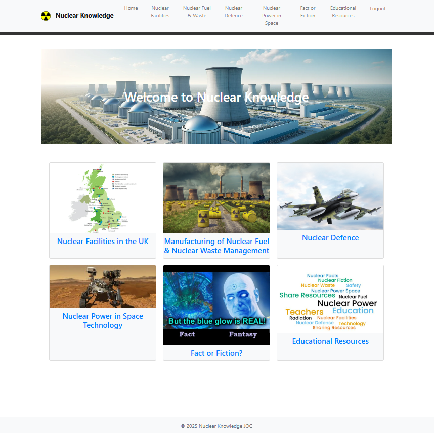

  

  Users arrive directly on the landing page which outlines the 6 categories of topics available immediately rather than requiring them to log in or register before being able to see anything. 
  I felt it would draw people in more and encourage them to then sign-up in order to see more.

 

**USER AUTHENTICATION**

**TOPIC CATEGORIES VIEW** 
  

  
Login Page

  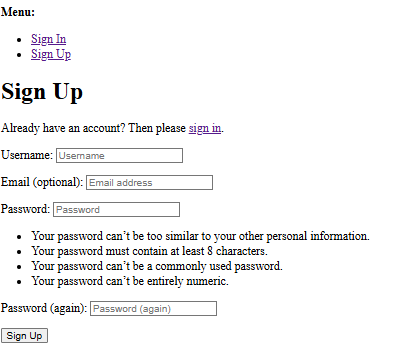
  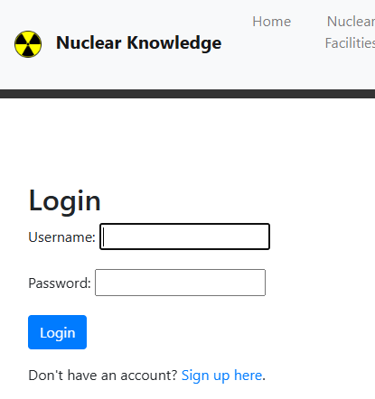
 
  

  Users must be registered via the sign up page and/or login to navigate from the landing page to a Topics/Category page and then to view the blogs. The login page will pop up if the user is not logged in when a landing page card/link is clicked. Incomplete fields will receive prompts. 
  
 
    
  **TOPIC-BLOG POST DETAIL VIEW**
  

  
The detailed view of each blog 

  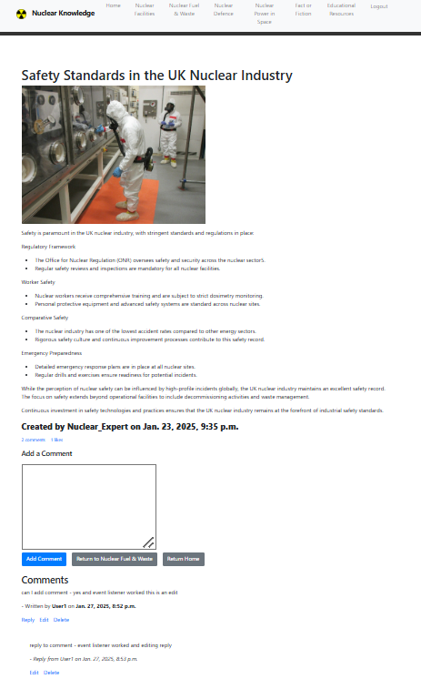

  

  Each topic blog post is shown with the image and the full detail of the post, including the blog post content, author information, and creation date, and displays the number of 'likes' and the number of 'comments'. Users can add comments to the post and can reply to comments, with nested replies displayed. Comments are displayed as a thread with most recent first. Users can edit and delete their own comments and replies. 

   

  **COMMENT FEATURE**
  

  
Comment box

  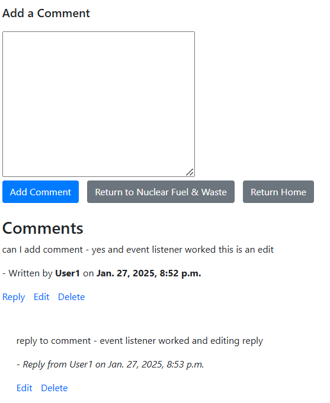

  

  Each blog post gives the user the option to add comments. They can also edit/delete comments they have previously made. The comments do not require admin authorisation and will appear immediately. Repies can be made to comments. 
  

 

  **CUSTOMISED ADMIN PANEL**
  

  
Admin Panel

  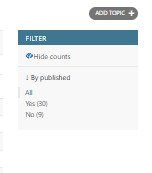
  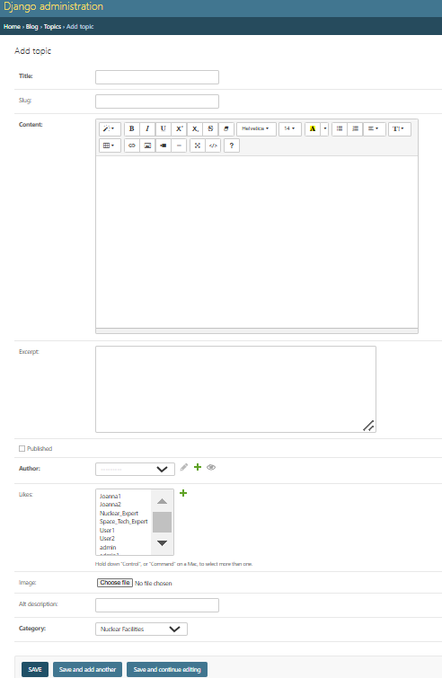

  

The admin panel, a feature of Django, was customized using Summernote to enhance the styling of the topics. A filter panel function was added to distinguish between published and unpublished topic-blogs. Additionally, a 'category' selector was integrated into the 'create topic' view to ensure new topic-blogs are assigned to the appropriate topic-page.

 

 ---

## FUTURE FEATURES
The following would be options to consider including in future versions of the website:

Next Sprint: 
  - The 'Like' button has disappeared from the topic-blog detail - to be reinstated. Since its disappearance the 'likes count' remains visible and admin can add likes from Topics in admin panel. 
  - Users have an option to contribute to any of the topics by creating a blog without the need for access to the admin panel, can save it as draft and continue to edit - although final approval for publishing would be at the discretion of the admin or trusted staff Users can view their own completed or partially completed published and unpublished blogs on their own 'My Topics' page. NOTE- this is partially developed at this stage but full functionality not yet complete. 

Additional Sprints:
  - The 'Educational Resources' page to be developed as a sharing page for educators to upload and download educational resources for the teaching and learning of Nuclear physics. 

  - An about page for information about each of the topic-blog creators - invite to a user who has created 10 successfully published blogs. 
    
  - Topic-blog authors can receive notifications (via a preferred method eg email or in-app) when other users comment on a blog-topic they have publsihed
    

## TECHNOLOGIES USED

  ### Languages Used

### Frameworks, Libraries, and Programs Used

 ---

### AI AUGMENTATION 
## Leveraging AI Tools for Code Creation ##
During the development of the 'Nuclear Knowledge' nuclear physics blog app, I utilized GitHub Copilot to assist in code creation. Copilot provided valuable code snippets and suggestions that accelerated the development process. Key areas where AI was used include:
- Generating Views and Templates: Copilot was instrumental in generating Django views and HTML templates. For instance, the initial structure of views such as nuclear_facilities, nuclear_fuel_waste, and nuclear_defence were generated using Copilot. These snippets provided a solid foundation, which I then manually checked and modified to fit the project's specific requirements.
 - Form Handling: Copilot assisted in creating forms for user input, such as CommentForm and TopicForm. The generated code snippets were reviewed and adjusted to ensure they met the application's validation and processing needs.
 - File and Directory Management: Copilot was invaluable in reminding me of the numerous files and directories to amend when new models, views, or features were introduced, ensuring that all the correct files were updated.
While Copilot provided a significant boost in productivity, it was essential to manually review and modify the generated code to ensure accuracy and alignment with project requirements.

- AI-Assisted Debugging
GitHub Copilot played a crucial role in identifying and resolving bugs. Key interventions include:
  - Error Handling: Copilot suggested error handling mechanisms for views and forms. For example, it provided initial code for handling form validation errors, which I then refined to improve user feedback and error reporting.
  - Debugging Views: When encountering issues with view logic, Copilot suggested potential fixes and improvements. These suggestions were cross-referenced with the current code using tools like Diffchecker and W3S to ensure the changes were appropriate and did not introduce new issues.

Manual use of Diffchecker was crucial in comparing Copilot's suggestions with the existing codebase, ensuring that only the most relevant and accurate changes were implemented.

- Optimizing Code for Performance and User Experience
Copilot was also used to optimize code for performance and enhance user experience:
  - Efficient Query Handling: Copilot suggested optimizations for database queries, such as using Django's select_related and prefetch_related to reduce the number of database hits and improve performance.
  - Responsive Design: Copilot provided initial CSS and JavaScript snippets to enhance the application's responsiveness. These snippets were manually adjusted to ensure a seamless user experience across different devices using my own color choices and fonts, as well as Bootstrap and Flexbox for structure and positioning.

- Generating Django Unit Tests
Copilot assisted in generating Django unit tests to ensure code coverage for key functionalities:
  - Test Logic Generation: Copilot generated initial test cases for views, forms, and models. For example, it provided test cases for creating, editing, and deleting comments, as well as liking and unliking topics. These tests were reviewed and adjusted to improve accuracy and completeness.
  - Ensuring Code Coverage: Copilot's suggestions helped ensure all critical paths were tested. For instance, it generated tests for edge cases, such as handling invalid form submissions and testing user permissions.
The generated test logic demonstrated a basic understanding of the application's functionality, and manual adjustments were made to ensure the tests accurately reflected the intended behavior.

- Additional AI Tools
In addition to GitHub Copilot, other AI tools were leveraged in much lesser forms:
  - Perplexity: Used for generic questions regarding feature planning and implementation, providing valuable insights and information.
  - Microsoft Copilot: Assisted in generating user stories and blog content based on key information provided by myself.
  - ChatGPT DALL·E: Used to create custom images, including the landing page masthead, enhancing the visual appeal of the application. However due to a daily 'image creation limit' the images were developed in stages. 
  - DeepSeek: Trialed for its excellent insights into processes applied to problems. However, it was often unavailable due to high traffic.

- Reflection on AI Tools
Using GitHub Copilot and other AI tools significantly enhanced the development process by providing relevant code snippets and suggestions. They accelerated the initial coding phase, assisted in debugging, and ensured comprehensive test coverage. However, it was essential to manually review and adjust the generated code to ensure it met the project's specific requirements and maintained high standards of quality and performance. Copilot can occasionally repeat itself despite clear prompts, as if it 'forgets' the previous steps or the focus of the initial query, which can be time-consuming. It is crucial to know when to manually take over reviewing the code.

## DEPLOYMENT
The site was deployed to Heroku. The steps to deploy are as follows:
 - Install the gunicorn python package and create a file called 'Procfile' in the repo's root directory
 - In the Procfile write 'web: gunicorn nuclear_knowledge.wsgi:application --log-file -'
 - In settings.py add ".herokuapp.com" to the ALLOWED_HOSTS list
 - In settings.py add 'https://*.herokuapp.com' to CSRF_TRUSTED_ORIGINS list, git add, commit and push to github

Navigate to the Heroku dashboard
 - Create a new Heroku app
 - Give it a name and select the region 'Europe'
Navigate to settings tab and scroll down to Config Vars
 - Click 'Reveal Config Vars'
 - Add the following keys:
         key = DATABASE_URL | value = (my secret database url)
         key = SECRET_KEY | value = (my secret key)
Navigate to Deploy tab
 - Connect to GitHub and select the repo 'lunar-lists'
 - Scroll down to 'Manual deploy' and select the 'main' branch
 - Click 'Deploy Branch'
   

 ---

## TESTING

 ### Unit Tests

The following automated Unit Tests were performed from test_views.py and test_forms.py:

| Test Category            | Test Description                                                                 |
|--------------------------|----------------------------------------------------------------------------------|
| **Test Setup**           | Initializes test data, including creating a regular user, an admin user, and a sample topic. |
| **Test Topic Detail Page** | Verifies that the topic detail page renders correctly with the topic details when accessed by an admin user. |
|                          | Ensures that the create topic page renders correctly and uses the appropriate template. |
|                          | Confirms that the edit topic page renders correctly and uses the appropriate template. |
|                          | Checks that the delete topic page renders correctly and uses the appropriate template. |
| **Test Forms**           | Ensures that the comment form is valid when provided with valid data.             |
|                          | Verifies that the comment form is invalid when provided with empty data.          |
|                          | Confirms that the topic form is valid when provided with valid data.              |
|                          | Ensures that the topic form is invalid when provided with empty data.             |
| **Test Models**          | Verifies that the string representation of the topic model returns the topic title. |
|                          | Ensures that the string representation of the comment model returns the first 20 characters of the comment body. |
| **Test Comment Functionality** | Verifies that a comment can be added to a topic.                              |
|                          | Ensures that a comment can be edited.                                             |
|                          | Confirms that a comment can be deleted.                                           |

  ### HTML validation

I have used the W3C Markup validator to validate all of my HTML code - [W3C Markup Validator](https://validator.w3.org/)

Pages in this project are developed using DTL and all except the landing page (and login, logout and sign-up pages which are Django admin tools that I have no control over) require user authentication. The HTML validator will throw errors if I were to use the URL so I followed the below approach for the landing page and the templates:
  - navigate to the deployed Heroku link
  - right click to find the 'view page source' link
  - copy and paste the HTML code from here into the validator via the direct input

[home page html validation](readme.docs/landing_page_validation.png)
[A topic page html validation](readme.docs/a_topic_page_validation.png)

HTML was checked and had no errors or warnings to show as indicated above. 
The home (landing) page had some initial syntax errors which were identified and corrected and then commited the code and the validation was clear.

   ### CSS validation

[CSS validation](readme.docs/css_validation.png)

[W3C CSS Validator](https://jigsaw.w3.org/css-validator/) was used to validate the CSS file. External CSS for Bootstrap, provided by [CDN](https://cdnjs.cloudflare.com/ajax/libs/bootstrap/5.2.3/css/bootstrap.min.css) was not tested.

   ### Javascript validation

  [JavaScript Validator](https://jshint.com) - the JavaScript validator was to be used - did not throw up and issues. 

   ### Python validation 
[CI Python Linter](https://pep8ci.herokuapp.com/#) was used to validate the python files I created or edited myself see table:

## PEP8CI Python Linter Results

| File Path | Description | PEP8CI Python Linter Result (after errors corrected)
|-----------|-------------|-----------------------------|
| `manage.py` | Project management script | E501 | all clear
| `blog/__init__.py` | Blog app initialization | all clear 
| `blog/admin.py` | Blog app admin configuration | all clear |
| `blog/apps.py` | Blog app configuration | all clear |
| `blog/forms.py` | Blog app forms | all clear|
| `blog/models.py` | Blog app models | all clear |
| `blog/urls.py` | Blog app URL configuration | all clear |
| `blog/views.py` | Blog app views | all clear |
| `blog/test_forms.py` | Blog app form tests | all clear |
| `blog/test_views.py` | Blog app view tests | all clear |
| `nuclear_knowledge/settings.py` | Nuclear Knowledge app settings | all clear |
| `nuclear_knowledge/urls.py` | Nuclear Knowledge app URL configuration | all clear |
| `nuclear_knowledge/wsgi.py` | Nuclear Knowledge app WSGI configuration | all clear |
  

## Lighthouse scores from Heroku deployed app via Chrome dev tools 
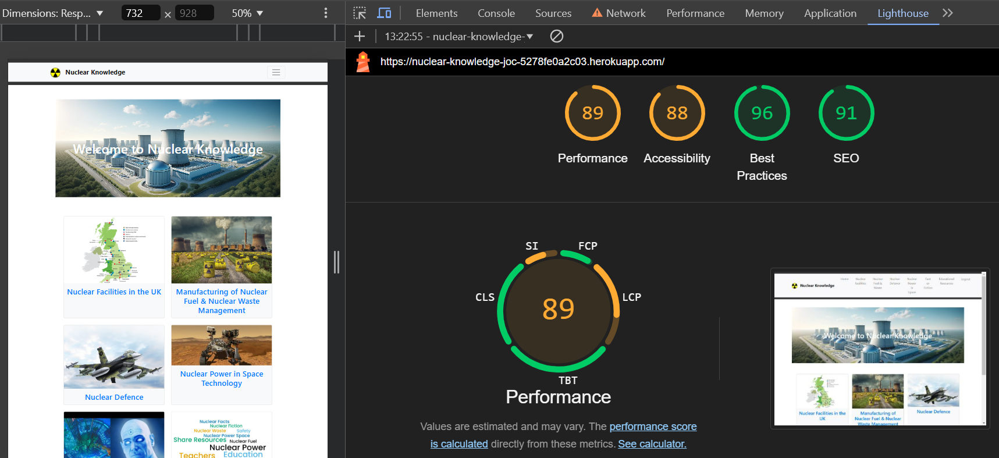

The performance score is acceptable. 
 - Accesibility 88% (close to the 90% breakpoint!) was due to an insufficent contrast ratio of the heading text in the masthead image (which can be improved in future sprint) although it passed 10 audits. 
  - Performance 89% (close to the 90% breakpoint!) was due to the size of some images (which can be reduced in future sprints). 18 audits passed. 

 

### Issues/Bugs
  
 Here is a very short snippet of the many bugs I encountered throughout the coding, testing and regular deployment of the app. 
 [Table of Bugs and Fixes](readme.docs/table_of_bugs_&_fixes_snippet.png)

### Agile Process

I adopted an agile methodology using a GitHub project board, applying MoSCoW prioritization to manage my tasks. The board was regularly updated to ensure all 'Must have' and 'Should have' features were addressed. Some 'Could have' issues remain in the backlog for future sprints, as detailed in the 'Future Features' section below.

Although I attempted to remain focused on the core tasks, I also integrated several additional features, such as:
-A 'like button'
-Displaying counts of likes and comments
-'Return to topic page' and 'Return home' buttons on blog-topic detail pages
-Replying to comments
-Displaying comments in a time-of-creation ordered thread

These enhancements, while beneficial, served as a reminder to maintain focus on the planned tasks within the agile methodology.
Also, I lost a lot of time implementing a feature (for users to create their own topic-blogs accessible without the need for admin using a 'Create your own blog' button on each topic page, that was published on the selected topic page when approved by admin, and users could view a list of all their created topic-blogs and edit them in their user-specific topic-blogs in a page called 'My Topics' accesible from the navbar) that was not a user story at all. I have removed this feature for the current deployemnt as it had some incomplete functionalities with respect to adding comments, and as viewing, adding, editing and deletion of comments is the CRUD functionality I am showcasing in the comments sections, I have left the completion of this as a future feaature to be completed in future sprints. 

## CREDITS

**Content**
    - [Helen Proudman/readme-example on GitHub](https://github.com/helproudman/nature-blog/blob/main/README.md) and [KSDunne/readme-example on GitHub](https://github.com/KSDunne/statement_beauty/blob/main/README.md)
   was used to help write the README.md
  - [Code Institute Sample README](https://github.com/Code-Institute-Solutions/SampleREADME)
  was used as a reference when writing the README.
  - [Code Institute](https://learn.codeinstitute.net/) The IDE was used for extra reference for HTML, CSS, Python and Django
  - [W3 Schools](https://www.w3schools.com/) was used for reference on syntax

  
**Media**
  - All images not 
  - [Amiresponsive](https://ui.dev/amiresponsive) for the responsivity mockup on the README.

  - [Ignore X frame headers](https://chromewebstore.google.com/detail/ignore-x-frame-headers/gleekbfjekiniecknbkamfmkohkpodhe)
    was used to download a Chrome extension to allow the resposivity image to be taken.

**Acknowledgements**
- Code Institute Facilitaor Dillon McCaffrey for his encouragement, patience, guidance and support.
- Code Institute SME Coach Mark Briscoe for coding advice
  and Roo MacAllister
- Code Institue Coding Coach Ruairidh MacArthur for coding advice
- My amazing cohort for the support and laughs and encouragement - particularly Geraldine Edwards and Amanda Flynn for keeping up my spirits when it all became overwhelming!